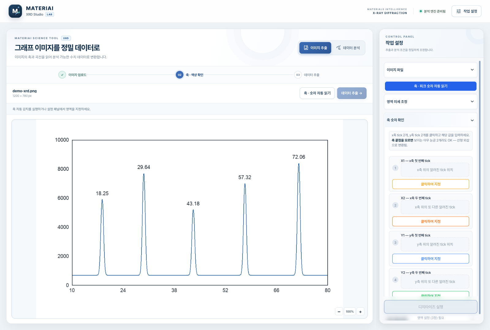
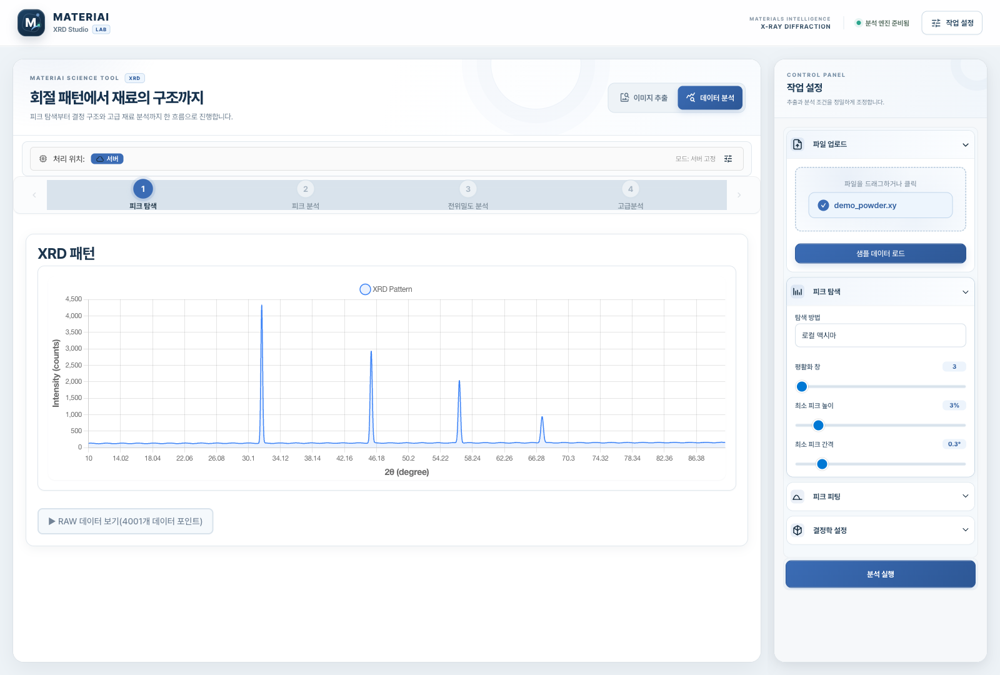
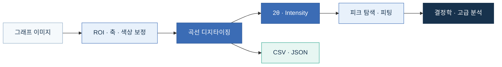
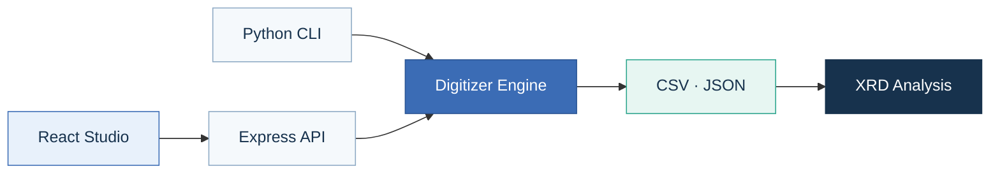

<p align="center">
  
</p>

<p align="center">
  <strong>논문 속 XRD 그래프를 다시 쓸 수 있는 수치 데이터로.</strong><br />
  축·피크 숫자 인식부터 곡선 추출과 결정학 분석까지 하나의 연구 워크스페이스에서 연결합니다.
</p>

<p align="center">
  <a href="https://github.com/seopseopi/XRD_Studio/actions/workflows/tests.yml"></a>
  
  
  
  <a href="LICENSE"></a>
</p>

<p align="center">
  <a href="#바로-실행"><strong>바로 실행</strong></a>
  &nbsp; · &nbsp; <a href="#성능-검증">성능 검증</a>
  &nbsp; · &nbsp; <a href="web/README.md">웹 사용법</a>
  &nbsp; · &nbsp; <a href="docs/engine.md">엔진 가이드</a>
</p>

<p align="center"><sub>상단 이미지는 XRD 곡선과 결정 구조를 표현한 브랜드 일러스트입니다. 실제 앱 화면은 아래에서 확인할 수 있습니다.</sub></p>

## 그래프를 다시 쓸 수 있는 데이터로

논문이나 보고서에 그림으로만 남은 XRD 패턴은 값을 다시 읽고 보정해야 후속 분석에 사용할 수 있습니다. XRD Studio는 이미지에서 축과 곡선을 복원하는 과정, 원본 위에서 결과를 확인하는 과정, 추출한 패턴을 분석하는 과정을 한 화면 흐름으로 묶었습니다.

## 한눈에 보는 작업 흐름

| `DIGITIZE` | `VERIFY` | `ANALYZE` | `EXPORT` |
|:---:|:---:|:---:|:---:|
| 그래프 이미지에서 곡선 추출 | 축·눈금·피크 숫자를 원본에서 검토 | 피크 피팅과 결정학 분석 | CSV와 재현 가능한 JSON 저장 |
| PNG · JPG · WEBP | 자동 감지 후 수동 미세 조정 | Scherrer · W–H · 텍스처 등 | 후속 분석 도구로 연결 |

> [!TIP]
> 파일이 없어도 웹 앱의 **예제로 체험하기**를 누르면 전체 작업 화면과 샘플 XRD 패턴을 바로 확인할 수 있습니다.

## 이미지에서 분석까지

| 이미지에서 데이터로 | 패턴에서 구조로 |
|:---:|:---:|
|  |  |
| 축·곡선·인쇄 숫자를 원본 위에서 확인하고 수치화 | XRD 패턴을 불러와 단계별 분석 조건을 설정 |

현재 앱을 1600 × 1080 환경에서 직접 캡처했습니다. 내장 샘플을 사용했으며 화면의 데이터는 데모 패턴입니다. [추가 화면과 캡처 조건](docs/screenshots/README.md)

## 워크플로



### 이미지 자동 읽기

축 교점, 눈금 값, 피크 옆 인쇄 숫자를 먼저 감지한 뒤 사용자가 원본 위치와 값을 확인할 수 있습니다. 분석 탭을 오가도 이미지와 보정 상태가 유지되며 작은 화면에서는 설정 패널이 본문 아래로 자연스럽게 이어집니다.

추가 합성 검사에서 축 경계 3 px 이내 탐지는 **14/48 → 48/48**, 축 숫자 범위 오차 1% 이내 복원은 **1/12 → 12/12**로 개선됐습니다. 인쇄 피크 숫자는 **29/30**개를 정확히 읽었습니다. 이는 합성 데이터 결과이며 실제 논문 사진 정확도와 동일하지 않습니다. [평가 조건과 한계](docs/axis-detection.md)

## 성능 검증

**2026-09-09 · 79개 패턴 × 3가지 렌더링 = 237개 검증 이미지**

| 수치 복원 오차 ↓ | 피크 재현율 ↑ | 2만 점 출력 속도 ↑ |
|:---:|:---:|:---:|
| **0.0821 → 0.0136** | **60.6% → 62.6%** | **약 7.5×** |
| 평균 정규화 MAE · **83.4% 감소** | 동일 prominence·매칭 기준 | 리샘플링 연산 기준 |


기존 버전 `2736a85`와 동일 입력·보정값으로 비교했습니다. 원본 수치에서 생성한 이미지이며 **실제 논문 스캔의 정확도를 뜻하지 않습니다.** 개발에 쓴 21개 패턴은 검증 세트에서 제외했습니다.

<details>
<summary><strong>수치·측정 조건·남은 한계 보기</strong></summary>

| 이미지 유형 | n | MAE 이전 | MAE 개선 후 |
|---|---:|---:|---:|
| Clean | 79 | 0.01574 | **0.01355** |
| Color + grid | 79 | 0.01978 | **0.01348** |
| Low contrast + noise | 79 | 0.21089 | **0.01380** |

- MAE는 GT intensity 범위로 정규화합니다. 원본 수치는 추론 입력으로 전달하지 않습니다.
- 피크는 GT 범위의 5% prominence, ±0.2° 내 일대일 매칭으로 비교합니다.
- 237개 모두 MAE가 감소했지만 피크 높이와 재현율이 모든 사례에서 개선된 것은 아닙니다.
- 이전 README의 ‘9만 개 검증·MAE 0.0079·Recall 99.7%’는 재현 가능한 전체 기록을 확인하지 못해 현재 성능 지표에서 제외했습니다.

[평가 방법과 재현 명령](docs/performance.md) · [전체 결과 CSV](docs/benchmarks/2026-09-09/per_case.csv) · [측정 JSON](docs/benchmarks/2026-09-09/summary.json)

</details>


## 바로 실행

Python 3.9 이상이 필요합니다. 샘플 이미지와 보정값은 저장소에 포함되어 있습니다.

```bash
git clone https://github.com/seopseopi/XRD_Studio.git
cd XRD_Studio

python3 -m venv .venv
source .venv/bin/activate
pip install -r requirements.txt

python -m runner.run_simple \
  --image_path examples/sample.png \
  --manual_inputs_path examples/sample_mi.json \
  --output_json_path result.json
```

`result.json`에는 `two_theta_values`, `intensities`, `peaks_numeric_curve`, 보정 정보와 경고가 저장됩니다.

<details>
<summary><strong>웹 앱 실행 · Node.js 18 이상</strong></summary>

```bash
cd web
npm run install:all

# 저장소 루트의 Python 환경 지정
export XRD_DIGITIZER_PYTHON="$(cd .. && pwd)/.venv/bin/python"
npm run start:server

# 새 터미널에서
cd web
npm run start:client
```

브라우저에서 [localhost:3000](http://localhost:3000)을 엽니다. 자동 ROI 감지에는 OpenCV, OCR에는 Tesseract가 추가로 필요합니다. 자세한 설정은 [웹 앱 가이드](web/README.md)를 참고하세요.

</details>

## 구성

```text
XRD_Studio/
├── preprocess/   # ROI · 마스크 · 대비 · 원근 보정
├── trace/        # 후보 생성 · DP 추적 · 경로 복구
├── calibrate/    # 픽셀 좌표 ↔ 2θ · intensity 변환
├── peaks/        # 평활화와 피크 검출
├── runner/       # CLI 파이프라인 진입점
├── web/          # React Studio + Express API
├── eval/         # 정량 평가와 비교 스크립트
└── tests/        # Python · 프론트엔드 회귀 검증
```



## 문서

| 가이드 | 내용 |
|---|---|
| [엔진과 추출 옵션](docs/engine.md) | 픽셀 추출 · DP 엔진 · 중심선 옵션 · 코드 구조 |
| [축·숫자 자동 감지](docs/axis-detection.md) | 평가 조건 · OCR · 자동 보정 · 한계 |
| [성능 개선 기록](docs/performance.md) | 데이터 보정 오류 · 알고리즘 변경 · 재현 가능한 비교 |
| [웹 앱](web/README.md) | 설치 · 환경 변수 · API · 분석 도구 |
| [테스트](tests) | `python -m pytest -q` · Python 3.9 / 3.12 CI |

---

<p align="center">
  <strong>그래프에서 결정 구조까지.</strong><br />
  <sub>MATERIAI XRD Studio · <a href="docs/screenshots/README.md">실제 화면</a> · <a href="docs/assets/README.md">배너 제작 기록</a> · <a href="LICENSE">MIT License</a></sub>
</p>
