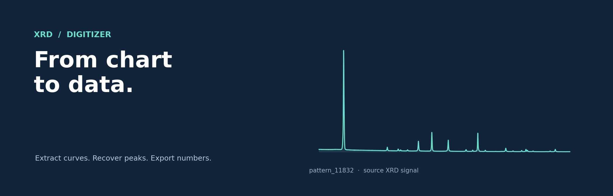
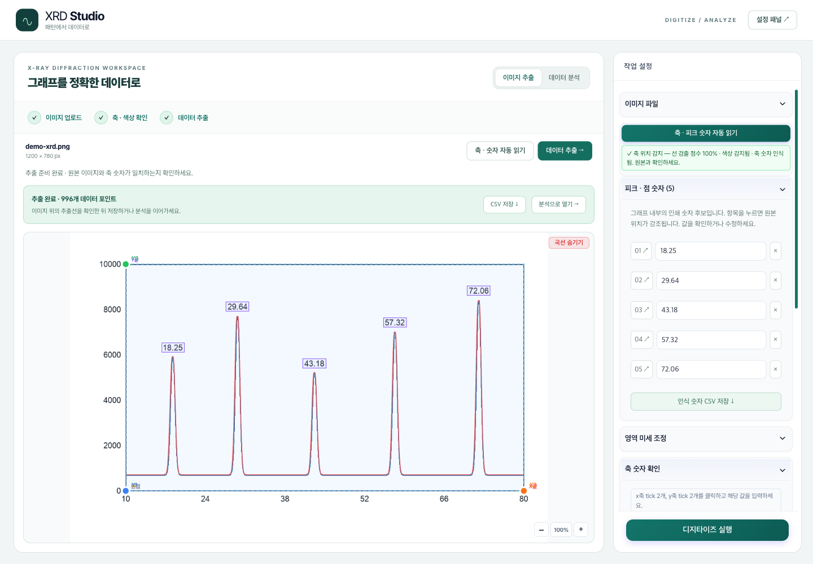
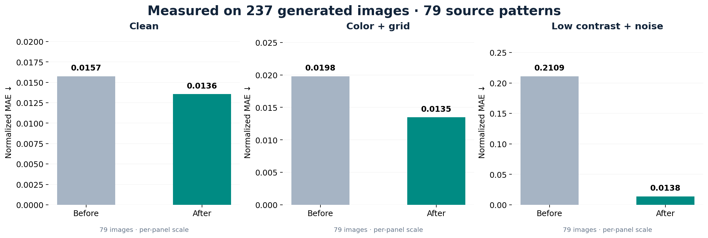
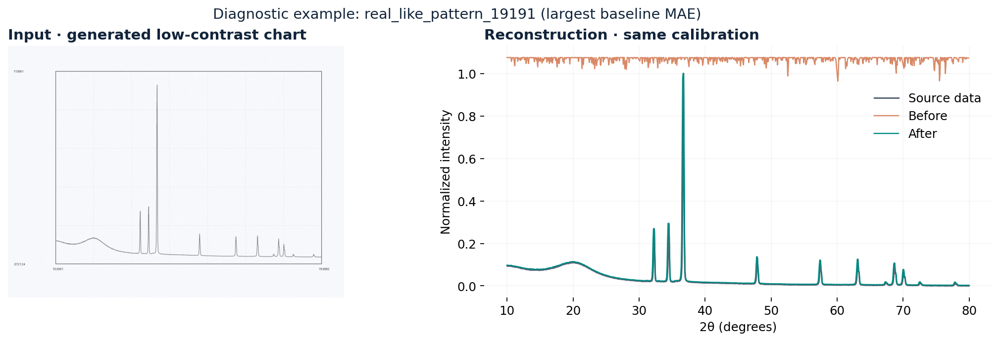

<div align="center">



논문 속 **XRD 그래프를 수치 데이터로.** 이미지 업로드부터 피크 분석까지, 하나의 작업 공간에서.

[](https://github.com/seopseopi/xrd_digitizer/actions/workflows/tests.yml)
[](requirements.txt)
[](web/client)
[](LICENSE)

[**바로 실행**](#바로-실행) · [**성능 검증**](#성능-검증) · [**웹 사용법**](web/README.md) · [**엔진 가이드**](docs/engine.md)

</div>

## 새 작업 화면 · 축과 피크 숫자 자동 읽기



| 자동 읽기 | 원본에서 확인 | 저장하고 분석 |
|:---:|:---:|:---:|
| 축 교점 · 눈금 값 · 피크 옆 인쇄 숫자 | 위치 강조 · 값 수정 · 곡선 겹쳐 보기 | 수치 CSV · 인쇄 숫자 CSV · 분석 연결 |

예제 이미지로 바로 체험할 수 있습니다. 작은 화면에서도 설정 패널을 사용할 수 있고, 분석 탭을 오가도 이미지와 보정 상태가 유지됩니다.

**추가 합성 검사:** 축 경계 3 px 이내 **14/48 → 48/48**, 축 숫자 범위 오차 1% 이내 **1/12 → 12/12**. 인쇄 피크 숫자 **29/30**개를 정확히 읽었습니다. 실제 사진 정확도와 동일하지 않으며, 축 위치 계산은 중앙값 12 → 71 ms로 늘었습니다. [평가 조건·한계·재현 방법](docs/axis-detection.md)

## 이미지에서 분석까지

| ① 그래프 → 수치 | ② 수치 → 분석 |
|:---:|:---:|
|  |  |
| ROI·곡선 색상 선택 → 축 보정 → JSON 추출 | 피크 피팅 · 결정성 · Scherrer · Williamson–Hall |


## 성능 검증

**2026-09-09 · 79개 패턴 × 3가지 렌더링 = 237개 검증 이미지**

| 수치 복원 오차 ↓ | 피크 재현율 ↑ | 2만 점 수치 출력 속도 ↑ |
|:---:|:---:|:---:|
| **0.0821 → 0.0136** | **60.6% → 62.6%** | **약 7.5×** |
| 평균 정규화 MAE · **83.4% 감소** | 동일 prominence·매칭 기준 | 리샘플링 연산만 측정 |



기존 버전 `2736a85`와 동일 입력·보정값으로 비교했습니다. 원본 수치에서 생성한 이미지이며 **실제 논문 스캔의 정확도를 뜻하지 않습니다.** 개발에 쓴 21개 패턴은 위 79개에서 제외했고, 이 검증 세트로 회귀와 출시 설정을 확인했습니다.

<details>
<summary><b>수치·측정 조건·남은 한계</b></summary>

| 이미지 유형 | n | MAE 이전 | MAE 개선 후 |
|---|---:|---:|---:|
| Clean | 79 | 0.01574 | **0.01355** |
| Color + grid | 79 | 0.01978 | **0.01348** |
| Low contrast + noise | 79 | 0.21089 | **0.01380** |

- MAE는 GT의 intensity 범위로 정규화합니다. 원본 데이터는 추론에 전달하지 않습니다.
- 피크는 GT 범위의 5% prominence, ±0.2° 내 일대일 매칭으로 비교합니다. 노이즈 피크도 포함되므로 기존 README의 피크 수치와 직접 비교할 수 없습니다.
- 237개 모두 MAE가 감소했지만, 피크 높이·재현율까지 모두 좋아진 것은 아닙니다. 개별 지표는 [전체 결과](docs/benchmarks/2026-09-09/per_case.csv)에 공개합니다.
- 이전 README의 ‘9만 개 검증·MAE 0.0079·Recall 99.7%’는 재현 가능한 전체 평가 기록을 확인하지 못해 현재 성능 지표에서 제외했습니다.

[평가 방법·재현 명령·제약](docs/performance.md) · [측정 JSON](docs/benchmarks/2026-09-09/summary.json)

</details>



## 바로 실행

Python 3.9 이상이 필요합니다. 샘플 이미지와 보정값은 저장소에 포함되어 있습니다.

```bash
git clone https://github.com/seopseopi/xrd_digitizer.git
cd xrd_digitizer
python3 -m venv .venv
source .venv/bin/activate
pip install -r requirements.txt

python -m runner.run_simple \
  --image_path examples/sample.png \
  --manual_inputs_path examples/sample_mi.json \
  --output_json_path result.json
```

결과: `two_theta_values`, `intensities`, `peaks_numeric_curve`, 보정 정보와 경고를 포함한 JSON.

<details>
<summary><b>웹 앱 실행 · Node.js 18 이상</b></summary>

```bash
cd web
npm run install:all

# 저장소 루트의 Python 환경을 지정
export XRD_DIGITIZER_PYTHON="$(cd .. && pwd)/.venv/bin/python"
npm run start:server

# 다른 터미널에서
cd web
npm run start:client
```

브라우저에서 [localhost:3000](http://localhost:3000)을 엽니다. 자동 ROI 감지에는 OpenCV, OCR에는 Tesseract가 추가로 필요합니다. 자세한 설정은 [웹 가이드](web/README.md)를 참고하세요.

</details>

## 더 알아보기

| 가이드 | 내용 |
|---|---|
| [엔진과 추출 옵션](docs/engine.md) | 기본 픽셀 추출 · DP 엔진 · 중심선 옵션 · 코드 구조 |
| [성능 개선 기록](docs/performance.md) | 데이터 보정 오류 · 알고리즘 변경 · 재현 가능한 비교 |
| [웹 앱](web/README.md) | 설치 · 환경변수 · API · 분석 도구 |
| [테스트](tests) | `python -m pytest -q` · Python 3.9 / 3.12 CI |

---

**이민섭 · [seopseopi](https://github.com/seopseopi)** — Materials Informatics · [MIT License](LICENSE)
