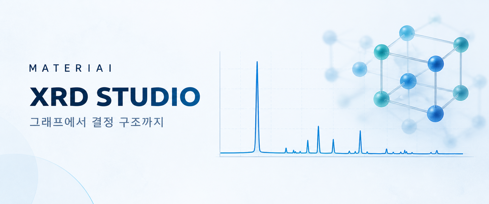

# XRD Studio README 배너



- 파일: [`docs/assets/xrd-studio-cover.png`](xrd-studio-cover.png)
- 용도: GitHub README 상단 소개 배너. 실제 앱 화면이나 측정 데이터가 아닌 브랜드 일러스트입니다.
- 제작일: 2026-09-12
- 제작 방식: 내장 이미지 생성 도구(`image_gen`)로 기존 시안을 편집했습니다. 외부 API나 CLI 모드는 사용하지 않았습니다.
- 방향: 다른 공개 레포의 전폭 커버 구성을 따르되, 현재 앱의 청회색·네이비·블루·틸 색과 XRD 곡선·결정 격자 모티프를 이어갔습니다.
- 검수: 영문·한글 표기, 밝은 배경에서의 대비, README 폭에서의 가독성을 확인했습니다. 실제 실험값이나 성능 수치는 포함하지 않습니다.

## 최종 생성 프롬프트

```text
Use case: style-transfer
Asset type: original GitHub README cover banner for MATERIAI XRD Studio
Input image: the current cover is the edit target; preserve the XRD diffraction curve and crystal-lattice idea, but redesign the full composition.
Primary request: match the calm, polished editorial cover system used by the owner's other repositories and the current light Scientific Calm app UI.
Scene/backdrop: pale cool blue-white background (#F5F9FC), subtle scientific-paper texture, generous whitespace.
Subject: a refined sculptural crystal lattice and one precise cobalt/teal XRD diffraction trace.
Composition/framing: wide landscape around 2.4:1, strong left-copy/right-illustration balance, broad safe margins.
Color palette: navy #17324D, cobalt #3B6CB5, teal #2CA58D, pale blue #E8F1FB, white.
Text (verbatim): eyebrow "MATERIAI"; headline "XRD STUDIO"; supporting line "그래프에서 결정 구조까지".
Constraints: render each requested line exactly once; no invented numbers, badges, tech logos, watermark, UI screenshot, dark full-bleed background, additional text, or random floating objects.
```
