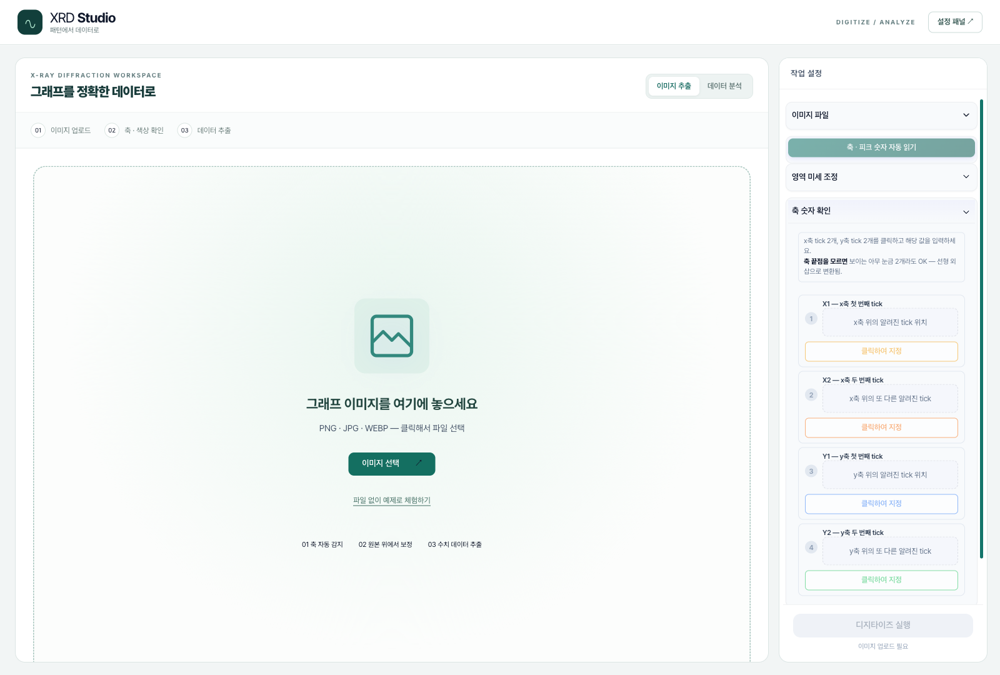

# XRD Studio 실제 화면

2026-09-09 · 로컬 앱 `/xrd` · 브라우저 뷰포트 **1600 × 1080**, 확대 100%.

모든 이미지는 현재 실행 중인 앱을 직접 캡처한 PNG입니다. 내장 합성 예제를 사용했으며, 표의 분석 수치는 데모 결과입니다.

## 이미지 업로드

## 축·피크 숫자 자동 인식

## 곡선 추출 완료

## 데이터 분석

캡처 재현: **예제로 체험하기 → 축 · 숫자 자동 읽기 → 데이터 추출 → 분석으로 열기 → 분석 실행 → 피크 분석**.
