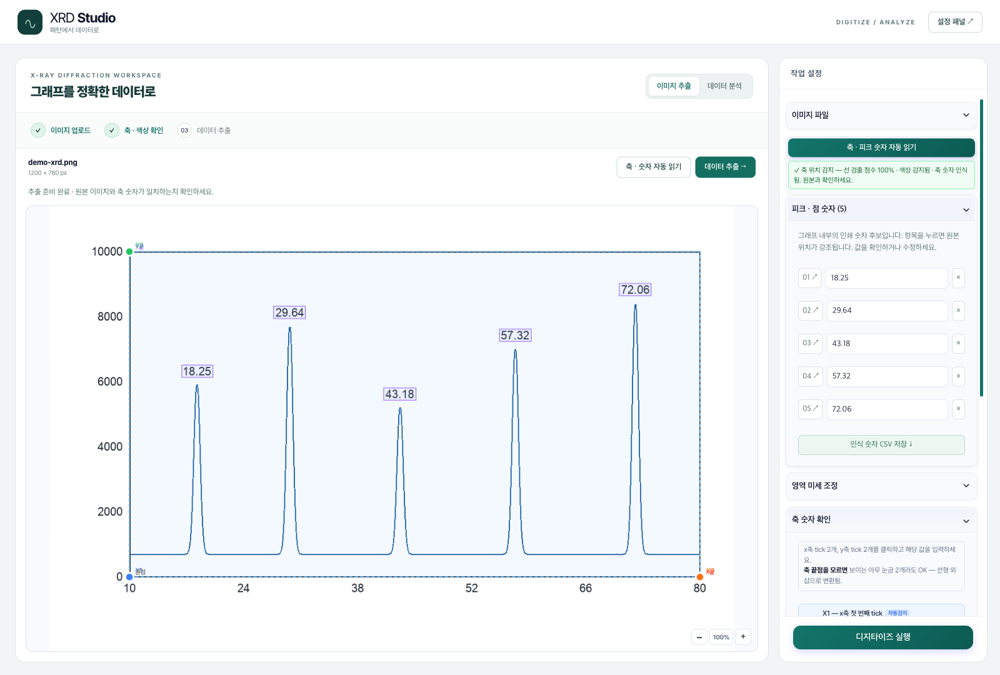
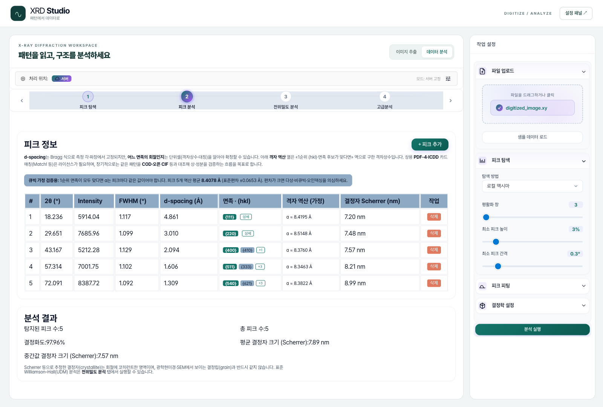

# XRD Studio

React (client) + Express (server) 기반의 XRD 디지타이저 & 분석 도구.
Python 파이프라인을 `child_process`로 호출해 이미지 → 수치 변환을 처리하고,
결정학적 분석은 Node 측에서 직접 수행합니다.

```
web/
├── client/   # React 18 SPA
│   └── src/pages/XRD/
│       ├── XRDDigitizer.js        # 이미지 → 수치 (3점 + 4점 캘리브)
│       ├── XRDAnalyzer.js         # 수치 → 피크/결정성/W-H/QPA/...
│       └── XrdAdvancedAnalysisSection.js
└── server/   # Node.js / Express
    ├── index.js                   # 서버 엔트리
    └── analysis/
        ├── routes/xrd.routes.js   # REST 엔드포인트
        ├── core/xrd.js            # 결정학적 분석 (JS)
        └── core/xrdDigitizer.js   # Python 파이프라인 호출 wrapper
```

## 이미지에서 바로 시작

1. **파일 없이 예제로 체험하기** 또는 PNG·JPG·WEBP 업로드.
2. **축 · 숫자 자동 읽기**로 축과 피크 옆 숫자를 찾습니다.
3. 숫자 목록에서 원본 위치를 확인하고 오독을 수정·삭제합니다.
4. 축 숫자와 곡선 색상을 확인한 뒤 **데이터 추출**을 누릅니다.
5. 원본 위 추출선을 확인하고 CSV 저장 또는 분석으로 이동합니다.

인쇄 숫자 CSV는 수치 곡선 CSV와 별도로 저장합니다. 인쇄 숫자의 위치는 문자 상자 좌표이며 실제 피크 정점 좌표가 아닙니다. [지원 범위와 측정 결과](../docs/axis-detection.md)

### 한 포트에서 실행

저장소 루트에서 실행합니다. 숫자 OCR에는 시스템 Tesseract가 필요합니다.

```bash
python -m venv .venv
.venv/bin/python -m pip install -r requirements.txt
# macOS
brew install tesseract
npm run install:all --prefix web
npm run build --prefix web/client
XRD_DIGITIZER_PYTHON="$PWD/.venv/bin/python" PORT=5000 npm run start:server --prefix web
```

브라우저에서 http://localhost:5000/xrd 를 엽니다.

## 🚀 Quick Start

### 1. 설치

```bash
# 레포 루트에서
cd web
npm run install:all
```

### 2. 실행 (두 개의 터미널)

```bash
# Terminal 1 — Express API (포트 5000)
npm run start:server

# Terminal 2 — React dev server (포트 3000)
npm run start:client
```

브라우저에서 <http://localhost:3000> 접속.
React dev server는 `/api/*` 요청을 `http://localhost:5000`으로 자동 프록시합니다 ([`src/setupProxy.js`](client/src/setupProxy.js)).

### 3. Production 빌드

```bash
npm run --prefix client build      # client/build 생성
npm run start:server               # Express가 build를 정적 서빙
```

## ⚙️ 환경변수 (`server/.env`)

```env
PORT=5000

# (선택) 사용할 Python 소스와 의존성이 설치된 인터프리터
XRD_DIGITIZER_PATH=/absolute/path/to/xrd_digitizer
XRD_DIGITIZER_PYTHON=/absolute/path/to/xrd_digitizer/.venv/bin/python3
```

소스 경로를 비우면 `web/server/analysis/python/xrd_digitizer`를 사용합니다. Python은 해당 소스의 `.venv/bin/python3`(Windows: `.venv/Scripts/python.exe`)를 찾고, 없으면 시스템 Python을 사용합니다. 루트에 설치한 환경을 쓰려면 `XRD_DIGITIZER_PYTHON`을 지정하세요.
샘플은 [`server/.env.example`](server/.env.example) 참고.

기본 엔진은 `runner.run_simple`이며 최신 색상·저대비 개선이 번들에도 포함됩니다. `XRD_USE_CLASSIC=true`는 DP 엔진, `XRD_USE_ML=true`는 별도 가중치가 필요한 ML 엔진을 선택합니다.

자동 ROI 감지를 쓰려면 해당 Python 환경에 `opencv-python`을 설치하세요. OCR에는 `pytesseract` 패키지와 시스템 Tesseract 설치가 추가로 필요합니다. 수동 축 보정만 사용할 때는 선택 사항입니다.

## 🔌 API Endpoints

모든 엔드포인트는 `POST /api/analysis/xrd/*`.

| Endpoint | 역할 |
|---|---|
| `/parse` | `.xy` / `.dat` / `.csv` 등 텍스트 데이터 파싱 |
| `/detect-roi` | 입력 이미지에서 ROI 자동 감지 |
| `/digitize` | 이미지 + `mi.json` → 수치 곡선 + 피크 |
| `/detect-peaks` | 수치 곡선 → 피크 좌표 + prominence |
| `/fit-peaks` | Pseudo-Voigt / Gaussian 피크 피팅 |
| `/calculate-crystallinity` | 결정성 (crystalline / amorphous 분리) |
| `/calculate-crystallite-sizes` | Scherrer 결정자 크기 |
| `/williamson-hall-fit` | Williamson-Hall 분석 |
| `/identify-phase-candidates` | 상(phase) 후보 식별 |
| `/compute-texture-indices` | Texture 지수 |
| `/estimate-qpa-phase-fractions` | QPA 정량 상분석 |
| `/fit-residual-stress-sin2-psi` | sin²ψ 잔류 응력 |
| `/index-miller` | Miller 지수 인덱싱 |
| `/analyze-dislocation` | 전위 밀도 분석 |
| `/get-rietveld-guidance` | Rietveld 가이던스 |

## 🧭 Tech Stack

- **Client** — React 18 · React Router 7 · Chart.js + zoom plugin · `ml-levenberg-marquardt` · `regression` · `crystcif-parse`
- **Server** — Express · Multer (파일 업로드) · `child_process` (Python 호출) · `pytesseract` (축 라벨 OCR · 선택)

## 📸 Screenshots

2026-09-09 현재 앱에서 내장 예제를 읽고 분석한 실제 화면입니다. [업로드 화면과 전체 캡처](../docs/screenshots/README.md)

| Digitizer | Analyzer |
|:---:|:---:|
|  |  |
